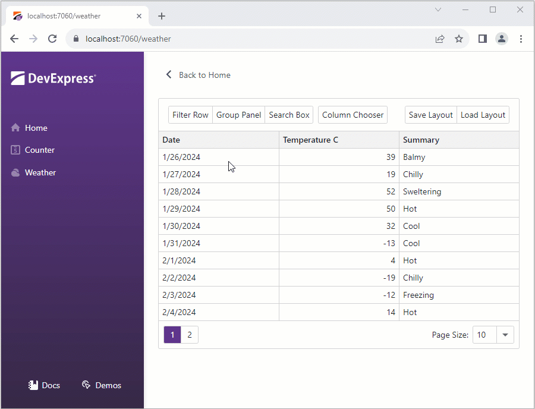

<!-- default badges list -->

<!-- default badges end -->
# Grid for Blazor - Save and load extended information about the Grid layout

The DevExpress [Blazor Grid](https://docs.devexpress.com/Blazor/403143/components/grid) allows you to save layout information between application sessions. This information includes only settings that a user can change in the built-in UI. This example illustrates how to extend the default layout object to save additional information about the Grid layout.

In this example, the Grid displays the following buttons in the [toolbar](https://docs.devexpress.com/Blazor/DevExpress.Blazor.DxGrid.ToolbarTemplate):

**Filter Row**  
Changes the [ShowFilterRow](https://docs.devexpress.com/Blazor/DevExpress.Blazor.DxGrid.ShowFilterRow) property value.

**Group Panel**  
Changes the [ShowGroupPanel](https://docs.devexpress.com/Blazor/DevExpress.Blazor.DxGrid.ShowGroupPanel) property value.

**Search Box**  
Changes the [ShowSearchBox](https://docs.devexpress.com/Blazor/DevExpress.Blazor.DxGrid.ShowSearchBox) property value.

**Column Chooser**  
Shows the [column chooser](https://docs.devexpress.com/Blazor/DevExpress.Blazor.DxGrid.ShowColumnChooser).

**Save Layout**  
Saves default layout object and values of [ShowFilterRow](https://docs.devexpress.com/Blazor/DevExpress.Blazor.DxGrid.ShowFilterRow), [ShowGroupPanel](https://docs.devexpress.com/Blazor/DevExpress.Blazor.DxGrid.ShowGroupPanel), and [ShowSearchBox](https://docs.devexpress.com/Blazor/DevExpress.Blazor.DxGrid.ShowSearchBox) properties to the [local storage](https://developer.mozilla.org/en-US/docs/Web/API/Window/localStorage).

**Load Layout**  
Loads layout settings from the [local storage](https://developer.mozilla.org/en-US/docs/Web/API/Window/localStorage) and applies them to the Grid.

## Files to Review

- [Weather.razor](./CS/ExtendedGridLayout/Pages/Weather.razor)
- [GridExtendedLayout.cs](./CS/ExtendedGridLayout/Data/GridExtendedLayout.cs)
- [LocalStorageHelper.cs](./CS/ExtendedGridLayout/Data/LocalStorageHelper.cs)
- [Program.cs](./CS/ExtendedGridLayout/Program.cs)

## Documentation

* [GridPersistentLayout](https://docs.devexpress.com/Blazor/DevExpress.Blazor.GridPersistentLayout)

## More Examples

- [Grid for Blazor - Save and load layout information](https://github.com/DevExpress-Examples/blazor-DxGrid-save-restore-layout)
<!-- feedback -->
## Does this example address your development requirements/objectives?

 

(you will be redirected to DevExpress.com to submit your response)
<!-- feedback end -->
